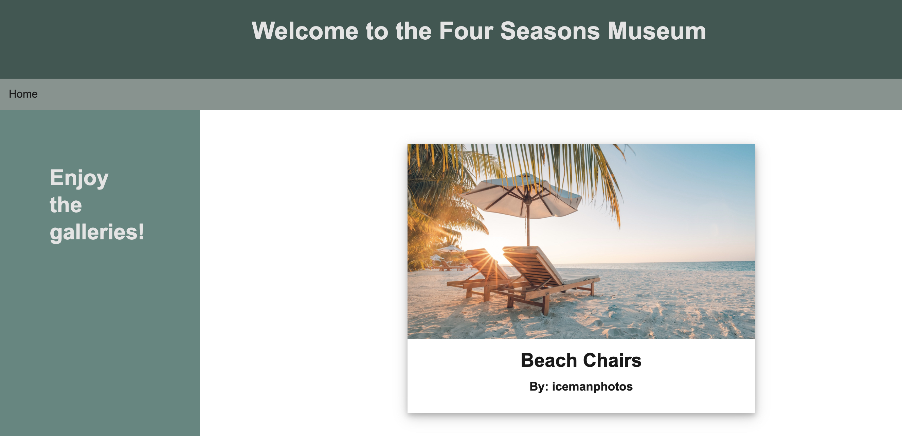

# 🏗️ Use Handlebars.js Partials to Reuse a Template

Work with a partner to implement the following user story:

* As a developer, I want to be able to render details of a painting by reusing the same Handlebars.js template.

## Acceptance Criteria

* It's done when the details for the paintings associated with the gallery are rendered using a Handlebars.js partial in the [gallery.handlebars](./Unsolved/views/gallery.handlebars) file.

* It's done when the `painting-details.handlebars` partial renders a card that links to that painting's page.

* It's done when the card includes a header with the painting's title.

* It's done when the card includes a body with the painting and the artist's name.

## Assets

The following image demonstrates how the painting's details should be rendered on the page:



---

## 💡 Hints

How do we set up the database? 
we need to seed it with the following command:

```sh  the command is node seeders/seed.js in the terminal step one is to run the command npm install to install the dependencies. then run the command node server.js to start the server. then run the command node seeders/seed.js to seed the database.
```
What command do we use to seed it? And what is the syntax for Handlebars.js partials?
We use the command node seeders/seed.js to seed the database. The syntax for Handlebars.js partials is {{>painting-details}}.

## 🏆 Bonus

If you have completed this activity, work through the following challenge with your partner to further your knowledge:

* What are some other ways that we can use Handlebars.js partials? How else can partials be useful?
To render the details of a painting. We can use partials to render the details of a painting, the details of a gallery, and the details of an artist.

Use [Google](https://www.google.com) or another search engine to research this.

---
© 2023 edX Boot Camps LLC. Confidential and Proprietary. All Rights Reserved.
