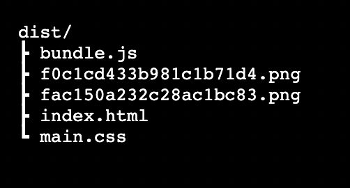

# 📖 Implement webpack Plugin to Generate Separate CSS File

Work with a partner to implement the following user story:

* As a developer, I want to extract a separate CSS file that is visible in the `dist` folder.

## Acceptance Criteria

* It's done when I have installed the `mini-css-extract-plugin`.
// we can install the mini-css-extract-plugin by running `npm install mini-css-extract-plugin --save-dev` in the terminal

* It's done when I run `npm install` and `npm run build` and a separate CSS file is displayed in my `dist` folder.
// we can start by adding the plugin to the webpack.config.js file and then we can add the loader to the webpack.config.js file by adding the mini-css-extract-plugin

## 📝 Notes

Refer to the documentation:

[webpack docs on MiniCssExtractPlugin](https://webpack.js.org/plugins/mini-css-extract-plugin/#getting-started)

## Assets

The following image demonstrates the web application's appearance and functionality:

---

## 💡 Hints

* What loader works with the `mini-css-extract-plugin`?
// we can use the css-loader because it will allow us to use the css file in our javascript file

## 🏆 Bonus

If you have completed this activity, work through the following challenge with your partner to further your knowledge:

* What other plugins can we use to enhance our code and improve performance?
// we can use the clean-webpack-plugin to clean the dist folder before each build and we can use the html-webpack-plugin to generate an html file for us

Use [Google](https://www.google.com) or another search engine to research this.

---
© 2023 edX Boot Camps LLC. Confidential and Proprietary. All Rights Reserved.
